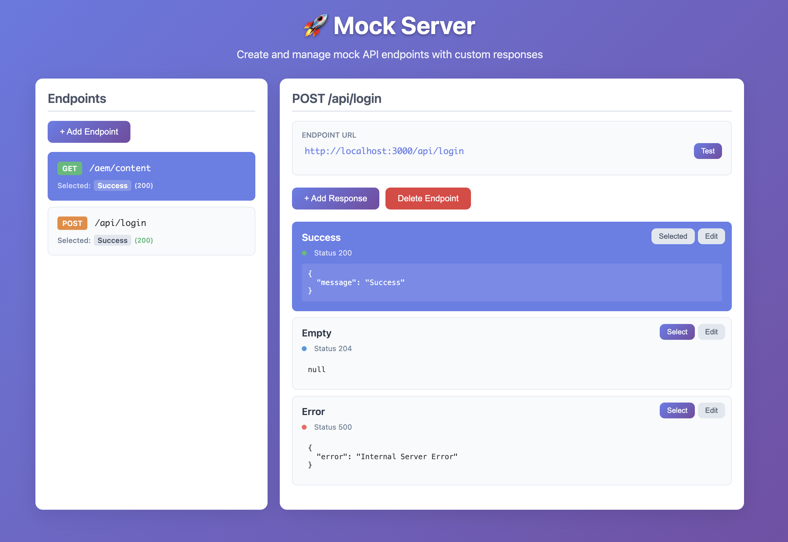

# Mocker Server

Simple Node.js mock server with a beautiful GUI for managing API endpoints and responses. Perfect for development, testing, and prototyping.

## Features



- 🎨 **Beautiful GUI** - Intuitive web interface for managing endpoints
- 🚀 **Easy Setup** - Start mocking APIs in seconds
- 📁 **File-based Storage** - All data stored in organized JSON files
- 🔄 **Real-time Testing** - Test endpoints directly from the GUI
- 📊 **Status Code Management** - Pre-configured dropdown with common HTTP status codes
- 🎯 **Path-based Organization** - Automatic folder structure based on API paths
- ✨ **JSON Validation** - Real-time validation with helpful error messages
- 🔒 **Reserved Path Protection** - Prevents conflicts with internal API routes
- 🌐 **Dynamic Paths** - Support for variable URL segments like `/users/{id}/posts`

## Installation

### Global Installation (Recommended)
```bash
npm install -g @draganfilipovic/mocker
```

### Local Installation
```bash
npm install @draganfilipovic/mocker
```

## Quick Start

### Using the CLI
```bash
# Start the server (uses ./mocks directory by default)
mocker

# Or specify a custom directory
MOCKS_DIR=/path/to/your/mocks mocker

# Or set a custom port
PORT=8080 mocker
```

### Using as a Module
```javascript
const mocker = require('@draganfilipovic/mocker');

// Start the server programmatically
mocker.start({
  port: 3000,
  mocksDir: './custom-mocks'
});
```

## Configuration

### Command Line Options

```bash
mocker [options]

Options:
  -p, --port <number>     Port to run the server on (default: 3000)
  -d, --mocks-dir <path>  Directory to store mock data (default: ./mocks)
  -h, --help              Show help message
```

### Environment Variables

```bash
# Set port and mocks directory
PORT=8080 MOCKS_DIR=./api-mocks mocker
```

### Examples

```bash
# Default settings
mocker

# Custom port
mocker --port 8080
# or
PORT=8080 mocker

# Custom mocks directory
mocker --mocks-dir ./api-mocks
# or
MOCKS_DIR=./api-mocks mocker

# Both custom port and directory
mocker --port 8080 --mocks-dir ./api-mocks
# or
PORT=8080 MOCKS_DIR=./api-mocks mocker
```

## Directory Structure

The server automatically creates the following structure:

```
your-project/
├── mocks/                    # Default mocks directory
│   └── endpoints/
│       ├── api/              # Static paths
│       │   └── users/
│       │       ├── get.200.Success.json
│       │       ├── get.404.Error.json
│       │       └── get.selected.json
│       └── users/             # Dynamic paths
│           └── __id__/        # {id} becomes __id__
│               └── posts/
│                   ├── get.200.Success.json
│                   └── get.selected.json
└── your-other-files...
```

## API Endpoints

### Mock API
- `ALL /your-endpoint-path` - Returns the selected mock response
- `ALL /users/{id}/posts` - Dynamic paths with variable segments

## GUI Features

### Endpoint Management
- Create endpoints with path and HTTP method
- Support for dynamic paths with `{param}` syntax
- Visual status indicators for each response
- Dynamic path indicators (🔄 icon and "Dynamic" badge)
- One-click endpoint testing
- Delete endpoints with confirmation

### Response Management
- Add custom responses with JSON bodies
- Pre-configured status code dropdown (20 most common codes)
- Real-time JSON validation
- Select active response per endpoint
- Edit and delete responses

### Testing
- Click endpoint URLs to open in new tab
- Built-in test button with response preview
- Real-time response display
- Dynamic path testing with example URLs
- Cache-busting headers prevent stale responses

## File Format

### Response Files
Files are named: `{method}.{statusCode}.{name}.json`

Example: `get.200.Success.json`
```json
{
  "message": "User retrieved successfully",
  "data": {
    "id": 1,
    "name": "John Doe",
    "email": "john@example.com"
  }
}
```

### Selection Files
Files are named: `{method}.selected.json`

Example: `get.selected.json`
```json
{
  "selectedResponseName": "Success"
}
```

## Dynamic Paths

Create flexible mock endpoints that handle variable URL segments using `{param}` syntax.

### Examples

**Basic Dynamic Path:**
```
/users/{id}
```
Matches: `/users/123`, `/users/456`, `/users/abc`

**Multiple Parameters:**
```
/users/{userId}/posts/{postId}
```
Matches: `/users/123/posts/456`, `/users/john/posts/my-post`

**Real-world Example:**
```
/users/auth/email-exists/{email}
```
Matches: `/users/auth/email-exists/test@example.com`

### How It Works

1. **Create Dynamic Endpoint**: Enter path like `/users/{id}/posts` in the GUI
2. **Visual Indicators**: Dynamic paths show 🔄 icon and "Dynamic" badge
3. **File Storage**: `{param}` becomes `__param__` in directory structure
4. **Path Matching**: Server matches any value for `{param}` segments
5. **Same Response**: All requests return the same mock response

### Testing Dynamic Endpoints

**In the GUI:**
- Click "Test" button - automatically uses example values
- View both original pattern and example URL

**With curl:**
```bash
curl http://localhost:3000/users/123/posts
curl http://localhost:3000/users/456/posts
```

**With JavaScript:**
```javascript
const response = await fetch('/users/123/posts');
const data = await response.json();
```

### File Structure for Dynamic Paths

```
Path: /users/{id}/posts
Files: mocks/endpoints/users/__id__/posts/
  - get.200.Success.json
  - get.500.Error.json
  - get.selected.json
```

## Development

### Running from Source
```bash
git clone https://github.com/easingthemes/mocker.git
cd mocker
npm install
npm start
```

### Building
```bash
npm run build
```

## License

This project is licensed under the MIT License - see the [LICENSE](LICENSE) file for details.

## Support

- 🐛 Issues: [GitHub Issues](https://github.com/easingthemes/mocker/issues)

## Changelog

### v1.1.0
- 🌐 **Dynamic Paths** - Support for variable URL segments like `/users/{id}/posts`
- 🔄 **Visual Indicators** - Dynamic path icons and badges in the GUI
- 🧪 **Smart Testing** - Automatic test value substitution for dynamic paths
- 🚫 **Cache Prevention** - No-cache headers prevent stale responses
- 📁 **Enhanced File Structure** - Automatic `{param}` to `__param__` conversion

### v1.0.0
- Initial release
- GUI for endpoint management
- File-based storage
- Real-time JSON validation
- Status code dropdown
- Path-based organization
- Reserved path protection

---

Made with ❤️ for developers who love clean, efficient mock servers.

(Actually made with Cursor AI)
